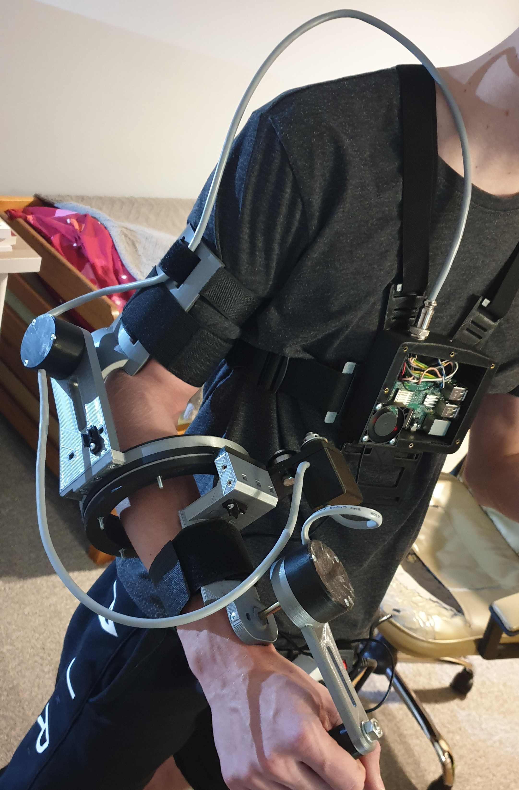

# ThesisExo

This is my Thesis. I print 3D exosceleton with potencjometers in axes. Everything works fine. I use 16-bit ADC ADS1115 to masure voltage from potenciometers.  

 

[More about exosceleton](https://przemyslprzyszlosci.gov.pl/egzoszkielet-z-politechniki-opolskiej-ktory-umozliwi-sterowanie-robotami/)
